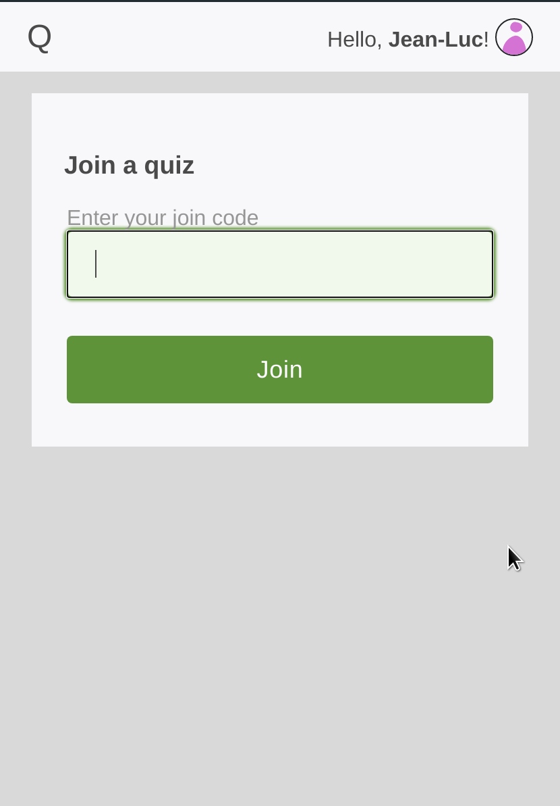
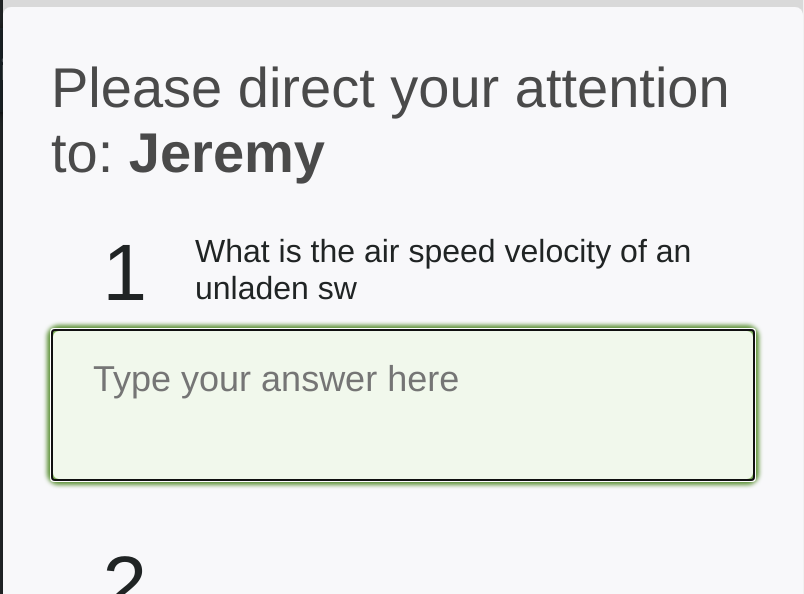

QuizMeister9000 is a web app for running a pub quiz among peers. ("Peers" in the sense that everyone is the quiz master for one round of questions.)

Gameplay
--------
When opening up the app, players can create a profile by answering these questions three.

If you have admin rights, the start page features a button that starts a new game.

This generates an invite code that other players may enter in order to join the quiz.

Once everyone's here, players vote to continue the game.

In each round, one player (selected randomly) reads their questions, while the others try to answer them. The question description becomes visible on the players' screens while the question-taker is typing.

The contestants' avatars indicate if they're still typing, or have entered text.

After all rounds are over, it's time to check the answers. To prevent favouritism, this is done anonymously.
Answers can be scored as correct, incorrect, or half-right. If multiple people answer the same, it'll need grading only once.

When everyone has graded their papers, the final score is calculated.

Building
--------
QuizMeister9000 has some compile-time dependencies:

* Go (≥ 1.15, though some older releases wil probably also work)
* NodeJS (≥ 14 - using a LTS release is highly recommended)

To compile this utility, try running:

    go run build.go

License
-------
This program and its source code are available under the terms of the BSD 3-clause license.
Find out what that means here: https://www.tldrlegal.com/l/bsd3
